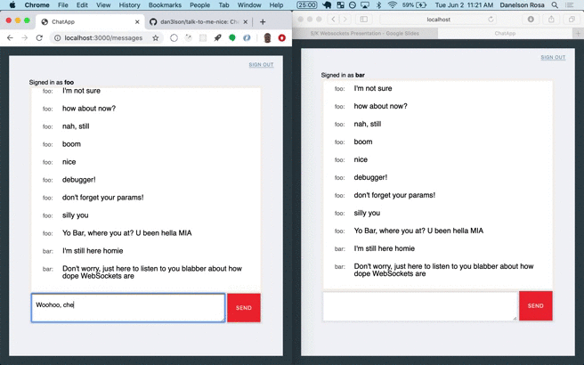

# Talk to Me Nice

A traditional Rails app where users can sign up and chat with one another
in real time. This is done with Action Cable and its usage of WebSockets.

Things to note:

* Ruby version: 2.7.3
* Rails version: 6.0.3
* Postgresql database

To run this repo locally:
- clone it
- `bundle install`
- `rails db:create`
- `rails db:migrate`
- `rails db:seed`, if you want to jump right in with two dummy users

* Run the lite test suite with `bundle exec rspec`